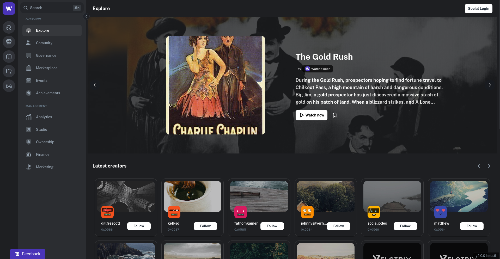

# WatchIt

WatchIt represents a transformative innovation in how audiovisual content is consumed and disseminated. Built on decentralized principles and powered by blockchain technology, the platform ensures secure, equitable, and dynamic content delivery through a network of distributed nodes. This architecture not only enhances system resilience but also fosters meaningful collaboration between creators and audiences, creating a vibrant and sustainable ecosystem.

By eliminating reliance on centralized servers, WatchIt paves the way for a transparent and efficient content distribution model. It empowers users to actively contribute and benefit from a decentralized network, establishing a future-forward framework for media sharing and interaction on a global scale.

## Features

- **Decentralized Content Delivery:** Content is shared through a secure, blockchain-supported network of distributors, ensuring scalability, robustness, and consistent availability across diverse geographical and technical landscapes.
- **Advanced Search and Filtering:** Users can seamlessly discover and explore content through precision-engineered tools tailored to individual preferences.
- **Optimized Playback Performance:** Experience uninterrupted, high-quality streaming with adaptive technology that dynamically adjusts to varying network conditions and device capabilities.
- **Enhanced Creator-Fan Interaction:** Enjoy a suite of social tools including interactive comments, personalized recommendations, and sharing options that strengthen the connection between creators and their audiences.
- **Flexible Monetization Models:** Empower creators with customizable access policies, enabling subscriptions, rentals, and direct purchases to suit their unique audience and content needs.

## Built with Synapse Technology

WatchIt leverages the innovative Synapse protocol for its secure and decentralized content distribution. By utilizing Synapse, WatchIt ensures robust access management, transparent royalty transactions, and a scalable infrastructure. This integration exemplifies how decentralized technology can revolutionize media distribution, ensuring fairness and resilience without relying on centralized systems.

## Getting Started

Embark on your journey with WatchIt and join the decentralized entertainment movement. Here’s how you can get involved:

- Visit our official site: [watchit.movie](https://watchit.movie)
- Join our community discussions: [Matrix](https://matrix.to/#/#watchit\:matrix.org) | [Discord](https://discord.gg/VdGMqNJgFq) | [Telegram](https://t.me/watchitofficial) | [Reddit](https://www.reddit.com/user/Watchit_V/)
- Support us on Open Collective: [Open Collective](https://opencollective.com/watchit)
- Explore our insights: [WatchIt - Open Movies](https://watchit.notion.site/A-New-Era-for-Creators-Countdown-to-the-First-Stage-of-Watchit-130c4b73826a80199722fa62137868bd?pvs=4)

## Contributors ✨

Thanks goes to these wonderful people ([emoji key](https://allcontributors.org/docs/en/emoji-key)):

<!-- ALL-CONTRIBUTORS-LIST:START - Do not remove or modify this section -->
<!-- prettier-ignore-start -->
<!-- markdownlint-disable -->
<table>
  <tr>
    <td align="center"><a href="https://github.com/xirapo"> <b>FranciscoGarcia</b></a> <a href="https://github.com/ZorrillosDev/watchit-app/commits?author=xirapo" title="Documentation">📖</a> <a href="https://github.com/ZorrillosDev/watchit-app/commits?author=xirapo" title="Code">💻</a></td>
    <td align="center"><a href="https://github.com/Jadapema"> <b>Jacob Peralta</b></a> <a href="https://github.com/ZorrillosDev/watchit-app/commits?author=jadapema" title="Code">💻</a> <a href="#design-jadapema" title="Design">🎨</a> <a href="#blog-jadapema" title="Blogposts">📝</a> <a href="#ideas-jadapema" title="Ideas, Planning, & Feedback">🤔</a> <a href="#userTesting-jadapema" title="User Testing">📓</a></td>
    <td align="center"><a href="http://mrh.io"> <b>Mark Robert Henderson</b></a> <a href="#mentoring-aphelionz" title="Mentoring">🧑‍🏫</a> <a href="https://github.com/ZorrillosDev/watchit-app/commits?author=aphelionz" title="Code">💻</a> <a href="https://github.com/ZorrillosDev/watchit-app/pulls?q=is%3Apr+reviewed-by%3Aaphelionz" title="Reviewed Pull Requests">👀</a> <a href="#userTesting-aphelionz" title="User Testing">📓</a></td>
    <td align="center"><a href="https://github.com/vaultec81"> <b>vaultec</b></a> <a href="#ideas-vaultec81" title="Ideas, Planning, & Feedback">🤔</a> <a href="#userTesting-vaultec81" title="User Testing">📓</a> <a href="#talk-vaultec81" title="Talks">📢</a></td>
    <td align="center"><a href="https://github.com/phillmac"> <b>phillmac</b></a> <a href="#ideas-phillmac" title="Ideas, Planning, & Feedback">🤔</a> <a href="#userTesting-phillmac" title="User Testing">📓</a> <a href="#talk-phillmac" title="Talks">📢</a> <a href="https://github.com/ZorrillosDev/watchit-app/commits?author=phillmac" title="Code">💻</a> <a href="#infra-phillmac" title="Infrastructure (Hosting, Build-Tools, etc)">🚇</a></td>
    <td align="center"><a href="https://vaibhavsaini.com/"> <b>vasa</b></a> <a href="https://github.com/ZorrillosDev/watchit-app/pulls?q=is%3Apr+reviewed-by%3Avasa-develop" title="Reviewed Pull Requests">👀</a></td>
    <td align="center"><a href="https://ipfs.io/ipns/k2k4r8lfpjmmno61mp5ofso67vl4pfengzeigah9bz0rw60nzpzqua0i"> <b>danrobi11</b></a> <a href="#ideas-danrobi11" title="Ideas, Planning, & Feedback">🤔</a> <a href="#userTesting-danrobi11" title="User Testing">📓</a> <a href="https://github.com/ZorrillosDev/watchit-app/issues?q=author%3Adanrobi11" title="Bug reports">🐛</a></td>
  </tr>
  <tr>
    <td align="center"><a href="https://github.com/justicenode"> <b>Ѵ∑1L</b></a> <a href="#ideas-justicenode" title="Ideas, Planning, & Feedback">🤔</a> <a href="https://github.com/ZorrillosDev/watchit-app/issues?q=author%3Ajusticenode" title="Bug reports">🐛</a> <a href="#userTesting-justicenode" title="User Testing">📓</a></td>
    <td align="center"><a href="https://github.com/Slender1808"> <b>Jadson G. Matos</b></a> <a href="#ideas-Slender1808" title="Ideas, Planning, & Feedback">🤔</a></td>
    <td align="center"><a href="https://github.com/Farickmenacode73"> <b>Farick Mena</b></a> <a href="#ideas-Farickmenacode73" title="Ideas, Planning, & Feedback">🤔</a> <a href="#platform-Farickmenacode73" title="Packaging/porting to new platform">📦</a> <a href="#userTesting-Farickmenacode73" title="User Testing">📓</a></td>
    <td align="center"><a href="https://github.com/mathiassond"> <b>mathiassond</b></a> <a href="#userTesting-mathiassond" title="User Testing">📓</a> <a href="https://github.com/ZorrillosDev/watchit-app/issues?q=author%3Amathiassond" title="Bug reports">🐛</a></td>
    <td align="center"><a href="https://yosephks.github.io/personal_website.github.io"> <b>Yoseph Kurnia Soenggoro</b></a> <a href="#ideas-YosephKS" title="Ideas, Planning, & Feedback">🤔</a></td>
    <td align="center"><a href="https://github.com/olwe1"> <b>olwe1</b></a> <a href="https://github.com/ZorrillosDev/watchit-app/issues?q=author%3Aolwe1" title="Bug reports">🐛</a></td>
    <td align="center"><a href="https://thestake2.netlify.app/stake2/"> <b>Stake2</b></a> <a href="https://github.com/ZorrillosDev/watchit-app/issues?q=author%3AStake2" title="Bug reports">🐛</a></td>
  </tr>
</table>

<!-- markdownlint-restore -->
<!-- prettier-ignore-end -->

<!-- ALL-CONTRIBUTORS-LIST:END -->

This project follows the [all-contributors](https://github.com/all-contributors/all-contributors) specification. Contributions of any kind welcome!

